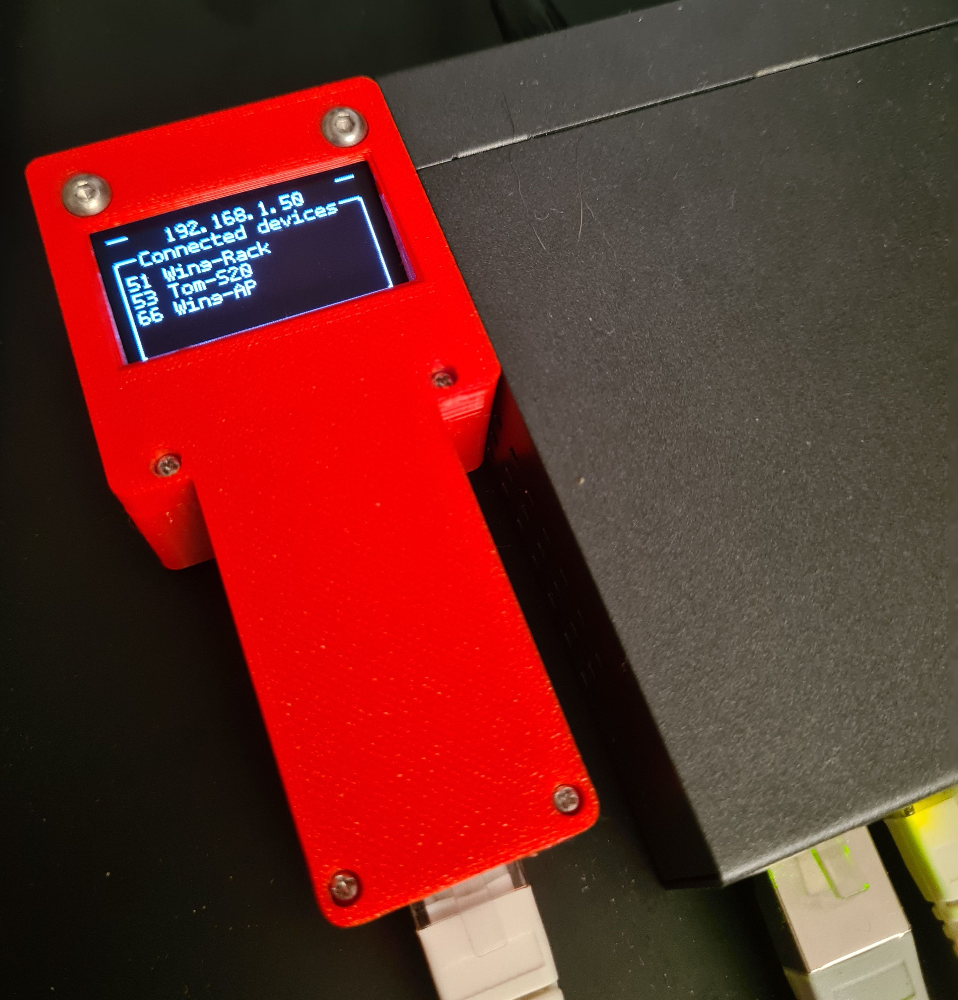
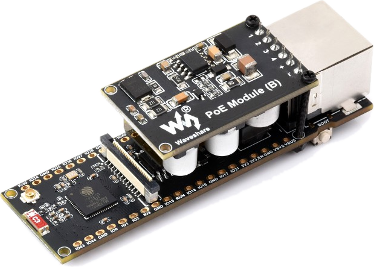
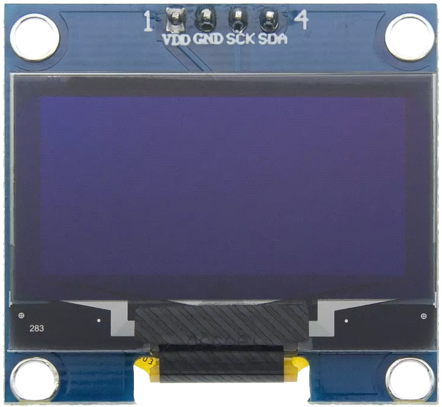

# WingEsp - Wireless Access Enabler for Behringer WING Mixing Console



The WingEsp is an ESP32 based connected device that enables smartphones and tablets to connect wirelessly to a Behringer WING mixing console by emulating internet connectivity check responses. WingEsp removes the barrier that prevents iOS and Android devices from joining networks without external internet connectivity.

## Problem Statement

Modern Android and iOS devices perform connectivity checks when joining a WiFi network. These checks query specific domains (e.g., `clients3.google.com`, `captive.apple.com`) expecting standard HTTP responses. If these checks fail, the device refuses to connect or displays persistent "no internet" warnings, making it impossible to use private WiFi networks that intentionally have no external internet.

## The Solution

WingEsp is a captive portal device that:
- **Intercepts DNS queries** from connected devices and redirects connectivity check domains to the local network
- **Responds to HTTP requests** with the appropriate responses to satisfy iOS and Android connectivity checks
- **Assigns IP addresses** via DHCP to enable seamless device connections
- **Provides network status visibility** through an optional OLED display

The result: smartphones believe they have internet connectivity and happily connect to your private network.

## Use Cases

**Primary**: Behringer WING Mixing Console Stage Monitoring
- Enables Behringer WING control apps to connect to the WING network:
  - **For Musicians** (Monitor Mix access): [WING-Q](https://apps.apple.com/us/app/wing-q/id1519012379) (iOS) and [WING-Q](https://play.google.com/store/apps/details?id=musictribe.q.wapp&pcampaignid=web_share) (Android) — critical for remote monitor mixing on stage
  - **For Sound Engineers** (Full Console Control): Optional wireless access via [Mixing Station](https://apps.apple.com/us/app/mixing-station/id1438352631) (iOS), [WING Copilot](https://play.google.com/store/apps/details?id=musicgroup.wapp&pcampaignid=web_share) (Android), and [Mixing Station](https://play.google.com/store/apps/details?id=org.devcore.mixingstation&pcampaignid=web_share) (Android). Direct wired connection to the mixing console or an additional switch is recommended for reliability; WingEsp is not supposed to interfere with or impact wired network paths.
- Network operates independently without requiring external internet

**General**: Any private LAN environment requiring mobile device connectivity
- Temporary or portable setups where infrastructure is minimal and internet is unavailable
- Closed operational networks that must remain isolated from upstream routers
- Environments where captive-connectivity checks block app usage unless explicitly handled

## Hardware

### Requirements

- **Waveshare ESP32-S3-ETH Board**
  - Integrated W5500 SPI Ethernet controller
  - 16 MB flash memory
  - Built-in USB Serial/JTAG console

     

- **Power**
  - Waveshare PoE Shield (recommended) - powers from Ethernet cable
  - Alternative: USB-C or external power supply

- **Optional Display**
  - SSD1306 or SH1106 1.3" OLED module (128×64)
  - Connects via I2C bus (current firmware defaults: GPIO 16/SCL, GPIO 18/SDA; SDA/SCL can be relocated)
  - Shows device IP, connected clients, and network status

     

## Software Stack

### Firmware Framework
- **ESP-IDF** (Espressif IoT Development Framework)
- **PlatformIO** - Build system and project management

### Core Network Services

**DHCP Server**
- Assigns unique IPv4 addresses to connected devices
- Default address pool: 192.168.1.51 - 192.168.1.70
- Supports up to 20 simultaneous clients (extensible within /24 subnet limits)

**DNS Resolver**
- Intercepts DNS queries for known connectivity check domains
- Redirects queries to local IP (192.168.1.50)
- Handles both iOS (Apple servers) and Android (Google servers) checks

**HTTP Server**
- Responds to connectivity check requests with appropriate responses
- Emulates behavior of genuine internet connectivity
- Returns 204 No Content for Android queries
- Returns basic HTML for iOS queries

**ARP Monitoring**
- Periodically scans network for active devices
- Tracks device presence and MAC addresses
- Uses a tracked devices list to map known MAC addresses to friendly names for OLED display (configured in [src/tracked_devices.c](src/tracked_devices.c))
- Displays active clients on OLED if available

### Display Driver
- **U8g2 Library** - Universal graphics library for OLED displays
- SH1106-compatible controller support
- Real-time status visualization

## Building and Flashing

### Prerequisites
- Visual Studio Code with PlatformIO extension
- USB-C cable for programming
- (Optional) USB-to-Serial adapter if using external programming interface

### Build
```bash
# Via VS Code: Run PlatformIO Build task
# Or via command line:
platformio run
```

### Flash
```bash
# Via VS Code: Run PlatformIO Upload task with your COM port
# Or via command line:
platformio run --target upload --upload-port COM13
```

### Monitor
Connect to serial console to view debug output:
```bash
platformio device monitor
```

## Configuration

### Network Settings
Most network configuration constants are defined in [include/wing_esp.h](include/wing_esp.h):
- **Device IP**: Static gateway address `192.168.1.50`
- **DHCP Pool**: Configured for 192.168.1.51 - 192.168.1.70 (modify start/end addresses and/or count)
- **DNS Domains**: Configure intercepted domains in [src/dns_server.c](src/dns_server.c)
- **Tracked Device Aliases**: Define MAC-address to display-name mappings in [src/tracked_devices.c](src/tracked_devices.c)
- **OLED I2C Pins/Address**: Set `OLED_SCL_GPIO`, `OLED_SDA_GPIO`, and `OLED_I2C_ADDR` in [src/OLED.c](src/OLED.c)

### Connectivity Check Domains (Currently Intercepted)
- `connectivitycheck.gstatic.com` (Android)
- `clients3.google.com` (Android)
- `captive.apple.com` (iOS)
- `www.apple.com` (iOS)
- `gs.apple.com` (iOS)

Additional domains can be added by updating the `allow_list` in [src/dns_server.c](src/dns_server.c).

### Board Configuration
ESP-IDF board settings are specified in `sdkconfig.esp32-s3-devkitc-1`:
```ini
CONFIG_ETH_SPI_ETHERNET_W5500=y
CONFIG_IDF_TARGET="esp32s3"
CONFIG_ESP_CONSOLE_USB_SERIAL_JTAG=y
```

## Operation

WingEsp operates exclusively in **Standalone Mode**:
- Device operates with a static gateway IP (192.168.1.50)
- Provides DHCP, DNS, and HTTP services to connected devices
- **Important**: The device must be connected to an isolated LAN with no upstream internet connection. If a router with internet connectivity is detected on the network, disconnect the device immediately to avoid network conflicts and address space collisions.

## Troubleshooting

### Start Here: USB Serial Monitor
- Connect WingEsp to your computer over USB
- Open a serial monitor and watch boot/runtime logs:
  - `platformio device monitor`
- Use these logs as the primary diagnostic source; DHCP, DNS, HTTP, ARP, and device-tracking events are logged in detail

### Devices Still Refuse to Connect
- **Check Logs First**: Confirm DHCP, DNS interception, and HTTP response logs in the USB serial monitor
- **Check DHCP**: Verify devices receive IP addresses (visible on OLED)
- **Check DNS**: Ensure connectivity check domains are being intercepted
- **Check HTTP**: Verify server is responding to queries on port 80

### OLED Display Not Working
- **Check Logs First**: Look for OLED and I2C initialization messages in the USB serial monitor
- **Check I2C pins**: Verify your configured SDA/SCL GPIOs are properly connected (current defaults are GPIO 18/SDA and GPIO 16/SCL)
- **Check I2C address**: Default is 0x3C (some modules use 0x3D)
- **Check address conflicts**: Ensure no other I2C devices are using the same pins
- **Avoid GPIO 21**: Ensure OLED SCL is not on GPIO 21 (connected to RGB LED)
- **Avoid Ethernet GPIOs**: Do not place OLED I2C on GPIO 9, 10, 11, 12, 13, or 14 (used by onboard W5500 Ethernet in [src/ethernet_init.c](src/ethernet_init.c))

### Ethernet Connection Issues
- **Check Logs First**: Confirm W5500/Ethernet initialization and link status in the USB serial monitor
- **Check physical connection**: Verify Ethernet cable is properly connected
- **Power cycle device**: Unplug PoE/power and reconnect

## Technical Notes

### Why This Solution?
Modern smartphone OSes perform connectivity checks as part of WiFi security:
- Devices query specific HTTPS/HTTP endpoints owned by Apple and Google
- Expected responses vary by platform and region
- Without proper responses, devices assume no internet and limit functionality

### DHCP and DNS Integration
- DHCP provides device IP addresses within the 192.168.1.51 - 192.168.1.70 range
- DNS server runs on port 53 and intercepts queries for known check domains
- Connectivity checks are redirected to the local HTTP server on port 80

### ARP and Device Tracking
- ARP sweep periodically probes the DHCP pool to discover active devices
- Timestamps track device presence with a 30-second guard window
- Prevents false removals from network hiccups

## Limitations

- **Isolated Networks Only**: This device is designed for isolated LANs with no upstream internet connection. Do not deploy on networks with active internet routers.
- **No Internet Forwarding**: The device intentionally does not provide internet access; it only emulates connectivity for check purposes
- **Limited Scope**: Connectivity checks are emulated only for known domains; other internet services will fail

## License

See [MIT License file](./LICENSE)
